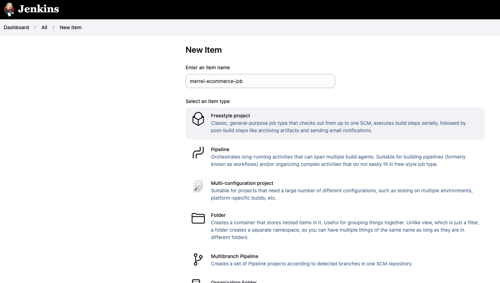

# jenkins-ecommerce
## Set up Git Project
### Create a Repository
- Go to your github dashboard.
- Click on the '+' icon close to your profile picture at the top right corner of the page.
- Click on `Create Repository` and supply the necessary information.
- See the image below for a full illustration
    

### Clone Repository
- Open your terminal
- Navigate to the director your want to place your repo directory
- Run
    ```git clone git@github.com:jesmanto/jenkins-ecommerce.git```
    

## Installing Jenkins on server
    The jenkins server will be installed on an AWS EC2 server. EC2 server has already been create. 
### Connect to the EC2 server using SSH
- Login to AWS console
- Goto EC2 service
- Click on instances and select the instance where you wish to install jenkins
    
- Connect to the server with ssh
    
## Installing Jenkins
- Update package repositories
    ```
    sudo apt update
    ```
- Install JDK

    ```
    sudo apt install default-jdk-headless
    ```
- Add a jenkins apt repository entry
    ```
    echo "deb [signed-by=/usr/share/keyrings/jenkins-keyring.asc]" \
    https://pkg.jenkins.io/debian-stable binary/ | sudo tee \
    /etc/apt/sources.list.d/jenkins.list > /dev/null
    ```
- Update your local package index, then finally install Jenkins:
    ```
    sudo apt-get update
  sudo apt-get install fontconfig openjdk-17-jre
  sudo apt-get install jenkins
    ```
- check if jenkins has been installed
    ```
    sudo systemctl status jenkins
    ```

    
- Add a new security rule to the EC2 server, to enable reach to the jenkins server using port 8080, which is jenkins default server.

    
### Setup Jenkins
-  Open a browser and access jenkins by typing `http://public_ip_address:8080`

    
- On the server, check `/var/lib/jenkins/secrets/initialAdminPassword` to see the Administrator password

    

- Install plugins needed to run different workflow in jenkins

    

- Create a jenkins user account

    

- Log in to Jenkins
    

#### Security Measures
- I ensured that I use strong passwords
- I configure firewalls to limit access to the Jenkins server from the public internet.
- I disable all unnecessary services, ports, and protocols that are not needed for Jenkins.

### Docker Installation
We need docker to containerize our ecommerce web app. We need to install it on the same server as the jenkins we installed earlier. To do this, use the commands below

```
sudo apt-get update -y
sudo apt-get install ca-certificates curl gnupg
sudo install -m 0755 -d /etc/apt/keyrings
```
```
curl -fsSL https://download.docker.com/linux/ubuntu/gpg | sudo gpg --dearmor -o /etc/apt/keyrings/docker.gpg
```
```
sudo chmod a+r /etc/apt/keyrings/docker.gpg
```
```
Add the repository to Apt sources:
```
```
echo \
"deb [arch=$(dpkg --print-architecture) signed-by=/etc/apt/keyrings/docker.gpg] https://download.docker.com/linux/ubuntu \
$(. /etc/os-release && echo "$VERSION_CODENAME") stable" | \
sudo tee /etc/apt/sources.list.d/docker.list > /dev/null
```
```
sudo apt-get update -y
sudo apt-get install docker-ce docker-ce-cli containerd.io docker-buildx-plugin docker-compose-plugin -y
```
```    
sudo systemctl status docker
```
## Jenkins Freestyle Jobs for Build and Tests
- Access jenkins dashboar through EC2 server through http://public-ip-address:8080
- Click on `New item`.
    This will opne a `New Job` window where you can select the type of job you want to create.
- Enter the job name
- Choose `Freestyle Project`

    
- Click `OK`

### Add Credentials
One of the security measures to take when working with jenkins is to abstract sensitive credentials from the jenkins file, when using a source code management. Follow the steps below to add new credentials

- On jenkins dashboad, click on `Manage Jenkins`
- Click on `credentials`

    

- Click on `Global`

    

- Click `Add Credential`

    

- Provide the credentials, and assign an `ID` for identification
    
    

- Click `Create`

### Configure Job
#### General
- Under the general section, you give a full `description` of what the job does
- Select Github project and enter the project url
    
#### Source Code Management and Integration
This part helps you to Connect and manage your code repository to automatically pull the latest code for your builds.
- Select `Git`
- Enter the repoository URL
- Select the credential that was earlier created
- Enter the branch to build from

    

#### Configure Trigger
This part helps you to Set up automated actions that start your build based on specific events, like code changes or scheduled times. Since we'ew working with Git, you will select `GitHub hook trigger for GITScm polling` option.

   

>Click on `Apply` to apply configurations. Then `Save`

#### Confirm connection of Jenkins to Github
- When you click `Save` it will take you back to the Job page
- Click on `Build Now`

    

#### Configure Github Webhook
- Login to github
- Open the project and click on settings tab
- On the left pane, click on `Webhooks`
- Click on `Add Webhook`, to add a new webhook

    

- Provide Payload URL, which is `jenkin-server-url/github-webhooks`
- Set Content type to `application/json` which is the object format used in jenkins.
- Click on `Add Webhook`

    

## Jenkins Pipeline for Web Application
The jenkins pipeline will be defiled in a `Jenkinsfile`, inside the root folder of the project. A jenkins file contains set of instructions and stages for the job to execute. Below is a breakdown of the Jenkinsfile used in this job.

`pipeline` is the parent object of a Jenkins job pipeline. Every other will be written inside the pipeline object

```
pipeline{

}
```
`agent` signifies the environment you want jenkins to run the automation
```
agent any
```
`environment` is for local variables

```
environment {
    IMAGE_NAME = 'jesmanto/node-ecommerce-app'
    IMAGE_TAG = 'latest'
}
```

`stages` houses every build step of the CI job. It starts from installing dependencies to uploading image to Dockerhub.

```
stages{
    stage('Checkout Code') {
            steps {
                checkout([
                    $class: 'GitSCM', 
                    branches: [[name: '*/main']], 
                    extensions: [], 
                    submoduleCfg: [], 
                    userRemoteConfigs: [[
                        credentialsId: 'github-credentials', 
                        url: 'https://github.com/jesmanto/jenkins-ecommerce.git']
                    ]
                ])
            }
        }

        ...
}
```

Each step of the jobis contained in the `stage` object
